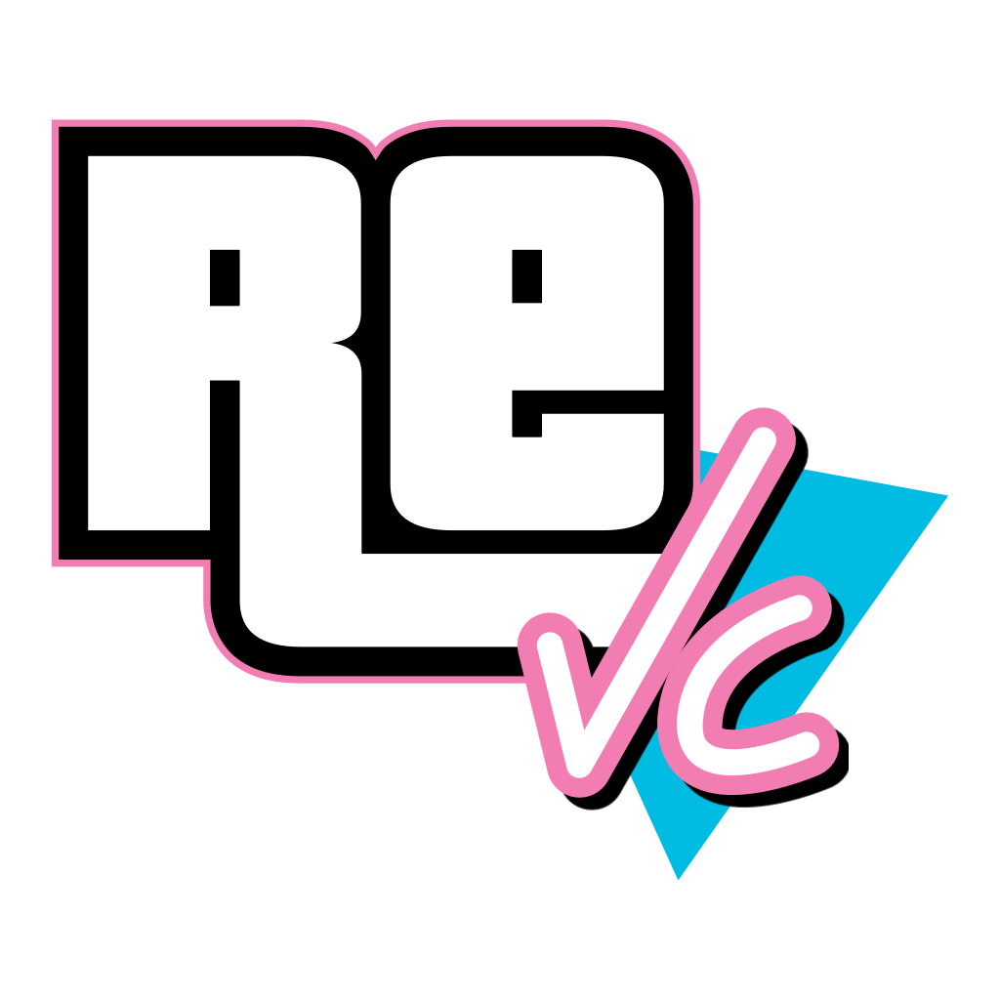

# Vice City VR



**Version:** `v0.2.1-alpha`

**Status:** Work in progress; not a final release and not yet fully playtested

**Author:** `#yevhen4817` on Discord

Vice City VR is a native PC VR adaptation of *Grand Theft Auto: Vice City*
built on the reverse-engineered reVC codebase and the open-source librw
RenderWare reimplementation. It preserves the original game, missions and data
while replacing the renderer and adding tracked-headset and motion-controller
gameplay.

This repository and its release archives do **not** contain the original game.
A legally obtained PC copy of *Grand Theft Auto: Vice City* (2003) is required.

## Highlights

- Native OpenXR PC VR with 6DOF head tracking and stereoscopic rendering.
- Tracked VR hands with per-hand and per-weapon calibration.
- Motion-controlled firearms, independent triggers, dual wielding, two-handed
  grips, physical hand-offs, and toss-and-catch weapon transfers.
- Physical punching and melee combat with bats, blades, the chainsaw, and other
  supported melee weapons.
- Physical grenade and Molotov throwing with a trajectory preview, plus an
  opposite-hand remote detonator for remote charges.
- Physical scopes and a usable mission camera; scoped shots converge on the
  headset reticle.
- Configurable body holsters and optional physical magazine reloads for
  supported one-handed firearms.
- Three vehicle-control modes: classic controls, physically grabbed immersive
  steering, and one-controller motion steering.
- Per-vehicle seat-distance calibration, adjustable driving height, optional
  motorcycle horizon lock, physical bike throttle and lean gestures, vehicle
  sidearms, and motion-controller drive-by shooting.
- Configurable smooth or snap turning, turn sensitivity, R3 sprint, and
  headset recentering.
- In-headset settings, weapon calibration, holster loadout, diagnostics, and
  cheat menus.
- World-locked theater presentation for startup movies, menus, loading
  transitions, and cutscenes.
- A Windows x64 Direct3D 12 renderer with full single-pass stereo, fixed
  foveated rendering through D3D12 VRS, supersampling, NVIDIA DLAA, and AMD
  FidelityFX Super Resolution 2 Native AA.
- Vice City lighting, colour filtering, fog, weather, wet surfaces, rain,
  shadows, water, coronas, transparent geometry, and HUD compatibility on the
  modern renderer.
- VR-safe visibility, wider world streaming, reduced object pop-in, and no
  duplicate full desktop world render while the headset is active.
- Asynchronous radio preparation and targeted renderer optimisations for stable
  high-refresh-rate play.
- Save and in-place restart support, including starting a second new game
  without restarting the executable.

## Requirements

- Windows 10 or Windows 11, 64-bit.
- A Direct3D 12-capable GPU.
- A PC VR headset and an active OpenXR runtime.
- A legal PC installation of *Grand Theft Auto: Vice City* (2003), including
  its original `anim`, `audio`, `data`, `models`, `movies`, `TEXT`, and other
  game-data directories.
- Microsoft Visual C++ 2015-2022 Redistributable (x64).

Meta Quest 3 through Quest Link or Air Link is the primary tested setup. The
mod uses OpenXR and does not require the legacy Oculus PC SDK. Other PC OpenXR
headsets may work but have not received the same level of testing.

NVIDIA DLAA requires a compatible NVIDIA RTX GPU and a current driver. FSR 2
Native AA is available through Direct3D 12 as the temporal alternative for
other GPUs. The original spatial anti-aliasing path remains available if
neither temporal backend is suitable.

The safe first-run rendering profile is **100% Render Scale + FXAA**, with
temporal AA disabled. This profile works across vendors and avoids multiplying
game supersampling by an additional SteamVR or headset-runtime resolution
scale. DLAA, FSR 2, and higher render scales are opt-in quality settings.

## Install a release

1. Install a legal PC copy of *Grand Theft Auto: Vice City* and make sure the
   original game data is present.
2. Back up any saves you want to keep.
3. Extract the Vice City VR archive into the game directory, next to
   `gta-vc.exe`. Allow Windows to merge the new `models` directory.
4. In your headset software, select it as the active OpenXR runtime.
5. Connect the headset through Quest Link, Air Link, SteamVR, or the equivalent
   PC VR connection.
6. Run `reVC.exe`. Keep `gta-vc.exe`; the mod does not replace or modify it.
7. If the initial viewpoint is misaligned, press both grips and both
   thumbstick clicks to recenter.

The archive is self-contained apart from the legally owned game data and the
system prerequisites above. Do not copy `reVC.ini` or `vr_settings.ini` from an
older package over an existing installation unless you intentionally want to
replace its settings and weapon calibration.

To remove the mod, delete the files supplied by its archive and
`models/vrhands`. The original game data is not changed.

## Physical VR controls

| Action | Default input |
| --- | --- |
| Move | Left thumbstick |
| Turn / look / vehicle steering | Right thumbstick |
| Sprint on foot | R3 |
| Enter, exit, and normal game actions | Standard A/B/X/Y controller mapping |
| Grab a weapon | Hold a grip near its body holster |
| Drop or throw a held weapon | Release its grip unless Grip Lock is enabled |
| Fire | Trigger on the weapon hand |
| Two-handed support | Grip the saved foregrip position with the free hand |
| Transfer a weapon | Grab it with the other hand, or toss and catch it |
| Punch | Close a free fist with grip and trigger, then swing |
| Use a melee weapon | Grab it from a holster and swing physically |
| Prepare a throwable | Grab the center-chest slot and hold that hand's trigger |
| Throw | Release the trigger after aiming the trajectory preview |
| Detonate remote charges | Use the trigger on the controller that appears in the opposite hand |
| Use a scope | Bring the aligned weapon to the eye; long guns also require the support hand |
| Use the mission camera | Bring it to the eye and press its trigger |
| Default-driving drive-by, left | Hold B + left grip |
| Default-driving drive-by, right | Hold B + right grip |
| Fire forward on a bike in default driving | Hold B without a grip |
| Change radio station | X while driving |

When optional manual reloading is enabled and a supported gun is empty, grab a
magazine from that weapon's body position with the free hand and insert it into
the magazine well. Manual reload currently supports the Colt .45, TEC-9, Uzi,
and Ingram. Other firearms continue to use the game's automatic reload logic.

## Vehicle control modes

Vehicle settings are available in the headset and can be changed without
restarting the game:

- **Default:** original gamepad-style steering with optional motion-controller
  drive-by shooting.
- **Immersive:** grab the physical steering wheel or motorcycle handlebars.
  Cars support one- or two-handed wheel control and horn interaction.
  Motorcycles support physical throttle, steering, wheelie and standing
  gestures.
- **Motion:** steer by rotating the selected controller, with a configurable
  left- or right-hand reference.

Driving height is global. Seat distance and physical control calibration are
stored per vehicle model. Motorcycle horizon lock is enabled by default to
reduce discomfort and can be disabled in vehicle settings.

## In-headset menus and shortcuts

| Chord | Action |
| --- | --- |
| Both grips + Menu | Open or close VR settings |
| Both grips + both triggers + X | Open or close VR settings (alternate headset-safe chord) |
| Both grips + B | Open or close the cheat menu |
| Both grips + A | Toggle the debug overlay |
| Both grips + Y | Start or stop a performance capture |
| Both grips + L3 + R3 | Recenter the gameplay view |
| Both grips + L3 + L2 | Toggle FULL and hybrid stereo diagnostic modes |
| Both grips + R3 + R2 | Cycle the fixed-foveated VRS profile |

Inside a VR menu:

- Left thumbstick: select an entry.
- L2 / R2: decrease or increase a value.
- A: open or select.
- B: go back or close.

The gameplay HUD is controlled only from VR settings. Its default is off.
Weapon lasers, body-holster highlights, and manual reloading also default to
off; physical scopes default to on. The default driving Y offset is +15 cm.
The locomotion submenu provides smooth or snap turning, adjustable turn
sensitivity, and a configurable snap angle. Experimental teleport movement is
not exposed in this release.

VR configuration and per-weapon calibration are stored in `vr_settings.ini`.
General reVC settings are stored in `reVC.ini`. Both files are created beside
the executable and are intentionally omitted from release archives so updates
do not erase a player's preferences.

On a fresh `v0.2.1` installation, Render Scale defaults to 100%, FXAA defaults
to on, and Temporal AA defaults to off. The legacy reVC 30 FPS limiter is
disabled in VR; OpenXR supplies headset frame pacing instead. Existing
`vr_settings.ini` choices are preserved during an update.

## Known limitations

- This is an alpha build and the complete campaign has not yet been played
  through on the release configuration.
- Meta Quest 3 is the primary tested headset; controller bindings or runtime
  behaviour may need adjustment on other OpenXR devices.
- Manual magazine reload currently covers only the supported one-handed guns
  listed above.
- FSR 2 Native AA is provided as a vendor-neutral temporal alternative, but its
  image quality can differ from DLAA because the legacy game renderer does not
  provide full per-object motion vectors.
- Per-hand weapon calibration remains exposed because some headset/controller
  combinations may need small alignment adjustments.
- FSR 2 refuses temporal allocation above its per-eye VRAM safety limit. If it
  reports an error at an extreme render scale, reduce supersampling or use the
  standard anti-aliasing path.
- Original executable plugins such as ASI modules, CLEO modules, and binary
  limit adjusters are not compatible unless separately ported to reVC.
- Save compatibility between unrelated reVC forks or substantially different
  builds is not guaranteed. Keep backups of important saves during alpha
  testing.

Please report reproducible problems with the headset/runtime, GPU, exact game
version, and the steps that caused the issue.

## Troubleshooting

**The headset stays in the home environment or shows a black screen**

- Confirm that the headset software is the active OpenXR runtime.
- Connect Link/Air Link or start the relevant PC VR runtime before `reVC.exe`.
- Check `openxr_d3d12.log` beside the executable.

**A runtime DLL is missing**

- Re-extract the complete release archive. Do not copy only `reVC.exe`.
- If Windows reports `MSVCP140.dll` or `VCRUNTIME140.dll`, install the Microsoft
  Visual C++ 2015-2022 Redistributable (x64).

**DLAA is unavailable**

- Update the NVIDIA driver and use a supported RTX GPU, or select FSR 2 in VR
  settings.
- Select the standard anti-aliasing option if both temporal modes report an
  error.

**Performance is unexpectedly low or locked near 30 FPS**

- Open VR settings with either supported chord and start with Render Scale at
  100%, Temporal AA set to OFF, and FXAA enabled.
- SteamVR and vendor headset software apply their own resolution scale. Avoid
  raising both the runtime scale and the in-game Render Scale at the same time.
- `v0.2.1` bypasses the original reVC 30 FPS limiter during VR gameplay. If an
  older executable is still present, replace it with the one from the complete
  `v0.2.1` archive.

**The viewpoint is offset**

- Recenter with both grips + L3 + R3.
- Adjust Driving Y Offset in VR settings for vehicle-specific comfort.

## Rendering architecture

The original game systems continue to issue RenderWare-style operations. librw
translates them to the project's Direct3D 12 backend. Gameplay is rendered to a
double-wide stereo target and resolved into OpenXR projection swapchains.
Menus and cutscenes retain their original 2D composition and are copied to a
world-locked OpenXR theater quad. The optional gameplay HUD is rendered and
submitted as a separate OpenXR layer.

```text
Vice City game systems
        |
        v
RenderWare-compatible interface
        |
        v
librw Direct3D 12 backend
        |
        +---- single-pass stereo world ---- OpenXR projection layer
        +---- gameplay HUD target -------- OpenXR quad layer
        +---- frontend / cutscene -------- OpenXR theater quad
```

The primary world pass shares visibility, animation, materials, lighting, and
draw preparation across both eyes. D3D12 Tier 2 VRS can lower peripheral
shading cost independently for each eye. The OpenXR resolve path supports live
render-scale changes and independently tracked per-eye temporal history for
DLAA or FSR 2 without recreating the VR session. FSR 2 currently runs as a
Native AA backend: render and output resolution match, while its temporal
reconstruction replaces the spatial fallback.

## Build from source

### Prerequisites

- Git with submodule support.
- Visual Studio 2022 with Desktop C++ and a Windows 10/11 SDK.
- A complete legal Vice City game directory for runtime testing.

Generate the solution:

```powershell
git submodule update --init --recursive
./premake5.exe vs2019 --with-librw --with-openxr-vr `
  --openxrsdk=vendor/openxr-1.1.58
```

Build the primary configuration:

```powershell
msbuild build/reVC.sln /m /t:Build /p:Configuration=Release `
  /p:Platform=win-amd64-librw_d3d12-oal
```

The executable is written to:

```text
bin/win-amd64-librw_d3d12-oal/Release/reVC.exe
```

Setting `GTA_VC_RE_DIR` before generating the solution enables the project's
post-build executable copy. Runtime DLLs and `gamefiles/models/vrhands` still
need to be staged for a distributable package.

## Diagnostics

- `openxr_d3d12.log`: OpenXR adapter, session, swapchain, and submission data.
- `streamline_dlaa.log`: Streamline/DLAA initialisation and frame data.
- `d3d12_external_copy.log`: D3D12 external-resource transfer diagnostics.
- `vr_perf_openxr_live.csv`: active performance capture.
- `vr_perf_openxr_YYYYMMDD_HHMMSS.csv/.txt`: completed performance capture.

## Repository layout

- `src/`: reverse-engineered game code and modern integrations.
- `src/vr/`: OpenXR, tracked-input, physical interaction, menus, and profiling.
- `src/audio/`: OpenAL audio and asynchronous stream preparation.
- `vendor/librw/`: RenderWare-compatible renderer and D3D12 backend.
- `vendor/openxr-1.1.58/`: OpenXR headers, loader, and runtime library.
- `vendor/streamline/`: NVIDIA Streamline/DLSS integration.
- `vendor/FidelityFX-FSR2/`: AMD FidelityFX Super Resolution 2 source and
  Direct3D 12 backend.
- `gamefiles/models/vrhands/`: converted UltimateXR hand assets and provenance.
- `premake5.lua`: build configurations and dependency selection.

## Credits

- re3/reVC contributors for the reverse-engineered game code.
- librw contributors for the RenderWare-compatible renderer.
- Khronos Group for OpenXR.
- Microsoft for Direct3D 12.
- NVIDIA for Streamline and DLSS/DLAA.
- AMD for FidelityFX Super Resolution 2.
- OpenAL Soft and mpg123 contributors for audio support.
- VRMADA for the UltimateXR hand assets used under the MIT License. Source and
  conversion details are recorded in `gamefiles/models/vrhands/SOURCE.md`.

Vice City VR is developed by **#yevhen4817 (Discord)**.

## Legal and licensing

*Grand Theft Auto*, *Grand Theft Auto: Vice City*, and related names and assets
are the property of their respective owners. This project is not affiliated
with or endorsed by Rockstar Games or Take-Two Interactive.

The project does not grant permission to distribute the original game data and
must not be used as a replacement for obtaining the game legally. Release
packages contain only the mod executable, its redistributable runtime
dependencies, project-created support assets, and required third-party notices.

The reverse-engineered re3/reVC codebase does not carry a conventional software
license. Third-party components and assets retain their own licenses; release
archives include the corresponding notices in the `licenses` directory.
